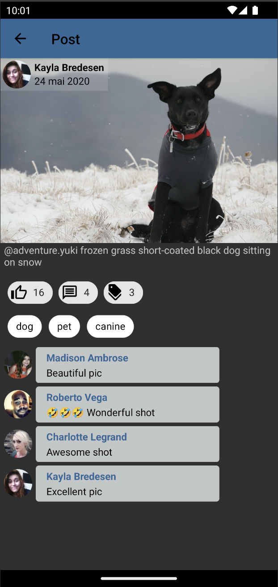
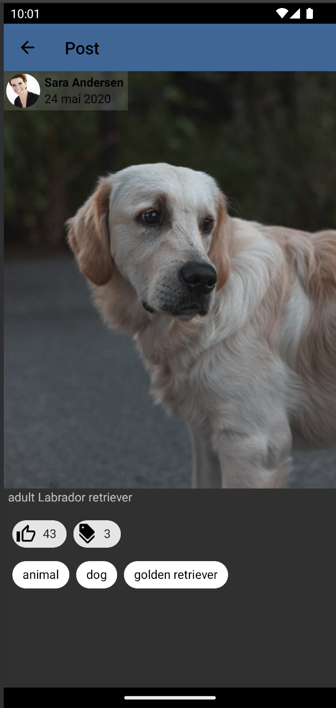

# Social Network

# Sujet

La communauté Android de Exalt développe une application pour partager des photos de leurs animaux de compagnie !

Cette application permet l'affichage d'une __liste de *posts*__, c'est-à-dire une photo d'un chien (ou chat) postée par une utilisateur, 
à une certaine date, avec une description et des tags. 
Chaque utilisateur peut en outre liker et laisser un commentaire sur un post. 

> L'application reposera sur __*dummyAPI*__ dont la documentation est disponible [ici](https://dummyapi.io/docs). 
> Il faut se créer un compte, lire la page __*Getting Started*__ et mettre l'app-id généré dans le fichier du projet `api.properties` sans oublier de `Sync Project with Gradle Files`.

Dans le cadre de cette exercice, la RGPD n'existe pas. 
Chaque utilisateur a un prénom, nom, genre, date de naissance, e-mail, téléphone et adresse physique.

A ce jour seul l'écran d'accueil a été implémenté. L'écran d'accueil affiche une listes de posts. (*post screen* comme vous pouvez le voir sur les screenshots plus bas.)

**Votre mission: ajouter une nouvelle page à cette application, la page Post, qui permet d'afficher les détails d'un Post.**

A **Exalt**, on ne plaisante pas avec le [Software Craftmanship](https://manifesto.softwarecraftsmanship.org/). L'application est donc implémentée en respectant scrupuleusement la [Clean Archi Android](https://medium.com/android-dev-hacks/detailed-guide-on-android-clean-architecture-9eab262a9011), et l'ajout de cette nouvelle page doit s'inscrire dans la structure de fichier donnée:

- le module `domain/` contient les différents **Use Cases** de l'application _(à implémenter)_
- le module `data/` contient l'interfaçage avec notre source de données (dummyAPI)
- le module `app/` contient l'UI des différentes pages _(à implémenter)_

## ⚠️ Rendu de candidature ⚠️ 

Création de la page post en clean archi, pour les tests du viewModels j'ai dû implémenter org.jetbrains.kotlinx:kotlinx-coroutines-test et androidx.arch.core:core-testing

|             post with comment screen              |                 post without comment                 |
|:-------------------------------------------------:|:----------------------------------------------------:|
|  |  |
