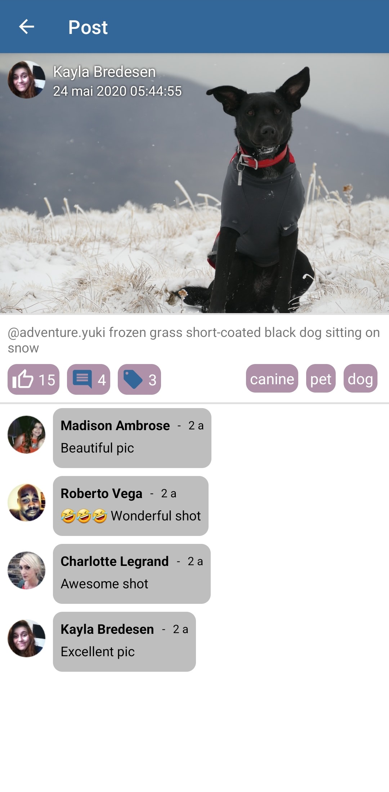
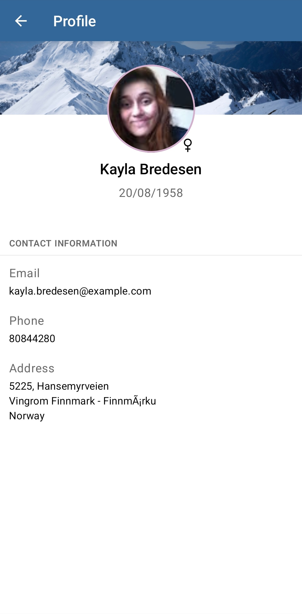

# Social Network

# Sujet

La communauté Android de Exalt développe une application pour partager des photos de leurs animaux de compagnie !

Cette application permet l'affichage d'une __liste de *posts*__, c'est-à-dire une photo d'un chien (ou chat) postée par une utilisateur, 
à une certaine date, avec une description et des tags. 
Chaque utilisateur peut en outre liker et laisser un commentaire sur un post. 

> L'application reposera sur __*dummyAPI*__ dont la documentation est disponible [ici](https://dummyapi.io/docs). 
> Il faut se créer un compte, lire la page __*Getting Started*__ et mettre l'app-id généré dans le fichier du projet `api.properties` sans oublier de `Sync Project with Gradle Files`.

Dans le cadre de cette exercice, la RGPD n'existe pas. 
Chaque utilisateur a un prénom, nom, genre, date de naissance, e-mail, téléphone et adresse physique.

A ce jour seul l'écran d'accueil a été implémenté. L'écran d'accueil affiche une listes de posts. (*post screen* comme vous pouvez le voir sur les screenshots plus bas.)

**Votre mission: ajouter une nouvelle page à cette application, la page Post, qui permet d'afficher les détails d'un Post.**

A **Exalt**, on ne plaisante pas avec le [Software Craftmanship](https://manifesto.softwarecraftsmanship.org/). L'application est donc implémentée en respectant scrupuleusement la [Clean Archi Android](https://medium.com/android-dev-hacks/detailed-guide-on-android-clean-architecture-9eab262a9011), et l'ajout de cette nouvelle page doit s'inscrire dans la structure de fichier donnée:

- le module `domain/` contient les différents **Use Cases** de l'application _(à implémenter)_
- le module `data/` contient l'interfaçage avec notre source de données (dummyAPI)
- le module `app/` contient l'UI des différentes pages _(à implémenter)_

## ⚠️ Rendu de candidature ⚠️ 

> Pour le rendu, pushez votre implémentation **sur une nouvelle branche "features/post"**, ouvrez une **Merge Request** vers la branche Main et notifiez votre interlocuteur par message que le kata est fini. La revue du kata se fera via la Merge Request.

## Pour aller plus loin...

Vous pouvez continuer d'ajouter des pages. Par exemple une page **Profil**, pour visualiser un utilisateur:

| home screen | post screen | user screen |
|:-----------:|:-----------:|:-----------:|
|  |  |  |

# Contexte & Motivation derrière le kata

Le développement mobile a plusieurs particularités : 

* **Fullstack** par nature (affichage + métier + données) -> besoin d’être à l’aise sur tous ces sujets 
  

* Résolument **multiplateforme**, car tributaire des différents hardware et OS des téléphones mobiles du marché. 

* Fortement sujet au changement, l’application étant généralement mise à disposition d’utilisateurs tôt dans le processus de développement. La facilité à ajouter de nouvelles features et à maintenir l’existant doit être pensée dès la phase de conception. 

* Nécessairement modulaire. L’interface change souvent, pour suivre les feedbacks utilisateurs … On ne peut pas en dire autant de la logique métier et du modèle. **Les modifications de l’interface ne doivent pas avoir d’effet de bord sur la logique métier sous-jacente.**

La [Clean Archi Android](https://medium.com/android-dev-hacks/detailed-guide-on-android-clean-architecture-9eab262a9011), que vous développerez dans ce kata, répond à ce particularisme. En séparant les couches applicatives en Domain / Présentation / Data indépendantes, on s’assure :  

* L’exécution des use-cases, contenus dans la couche Domain, ne dépend pas du device exécutant l'application 

* Les trois couches peuvent évoluer séparément, sans effet de bord, et être reliées par [injection de dépendance](https://linuxpip.org/markdown-change-image-size/)

# Specification [RFC2119](https://microformats.org/wiki/rfc-2119-fr) du kata

- Vos choix d'implémentation et de dépendence à des libraries externes `DOIVENT` être justifés dans un Readme. D'autres justications sur des problèmes que vous avez rencontrés ou sur ce que vous auriez aimé faire autrement `PEUVENT` être ajoutés au Readme.

- L'UI `PEUT` être développée selon votre préférence en *vues XML classiques* ou via *Jetpack Compose* comme vous le souhaitez.

- Les *UseCases* et les *implémentations de Repositories* `DOIVENT` être testés unitairement.
D'autres classes comme les *mappers* ou les *ViewModels* `DEVRAIENT` être testés unitairement.

- Le repo git de votre solution `DOIT` contenir des screen shots des écrans développés et `DOIT` contenir un apk. Cet apk `PEUT` être de type *debug* et `DEVRAIT` être mis dans une *release* : [Github](https://docs.github.com/en/repositories/releasing-projects-on-github/managing-releases-in-a-repository) ou [Gitlab](https://stackoverflow.com/a/50442578).